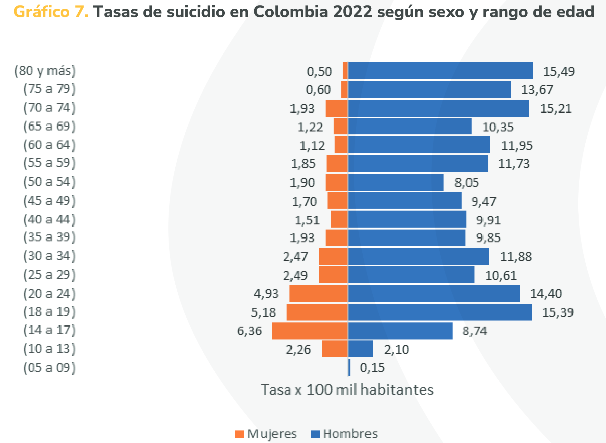
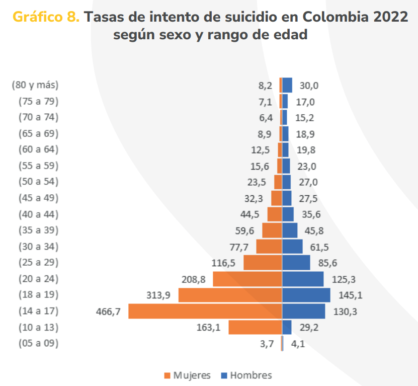

# **Introducción**

La salud mental es un aspecto del bienestar del ser humano, y la conducta suicida es una problemática actual a nivel mundial de salud pública, la cual requiere gran atención de parte del estado colombiano, así como de otros. En Colombia, las tasas de conducta suicida han demostrado un comportamiento que varía gracias a factores demográficos, desencadenantes y de riesgo. También es posible identificar la preferencia de ciertos métodos para realizar el acto suicida, que pueden ser claves para ayudar a prevenir los casos.

En el siguiente estudio nos centraremos en explorar DataSet sobre contexto y características de la vida de personas que intentaron suicidarse en Colombia, aunque centrado en Santander. Se busca comprender mejor las razones que llevaron a las personas a tomar esta decisión mediante el análisis de las variables que ofrece el DataSet.

El objetivo de este proyecto es aportar información para orientar el diseño de estrategias preventivas públicas que busquen ayudar a reducir estas tasas desde una intervención temprana hacia personas propensas.

La pregunta de investigación de este proyecto es: ¿Cuáles son los factores demográficos, desencadenantes y de riesgo y los mecanismos de autolesión más frecuentes en los intentos de suicidio, y cómo se pueden orientar estrategias para reducir su incidencia?

# **Metodología**

La metodología del proyecto se centra en la generación de gráficas que faciliten el análisis de los factores que influyen en los casos intentos de suicidio. Entre estos factores se incluyen características demográficas, métodos utilizados, factores desencadenantes y factores de riesgo.

El objetivo de estas gráficas es proporcionar una comprensión más clara sobre cuáles son los elementos que tienen mayor incidencia en la ocurrencia de estos casos. Esto permitiría identificar las áreas prioritarias en las cuales deben enfocarse las políticas públicas orientadas a reducir la incidencia de los intentos de suicidio, buscando promover alternativas que disuadan a las personas de considerar esta opción como la única solución a sus problemas.

Las gráficas serán presentadas en la sección de resultados de este informe, mientras que se realizará su análisis respectivo en la sección de discusión.

## Características del DataSet

Es necesario destacar que pese a que el DataSet contiene datos de varios departamentos, o incluso de Venezuela, este se centra enormemente en datos de casos ocurridos en Santander.

```{r}

df <- read.csv("intencion_suicida_datos.csv")

frecuencias_departamentos <- sort(table(df$nmun_resi), decreasing = TRUE)

porcentajes <- prop.table(frecuencias_departamentos) * 100

tabla <- data.frame(
  Departamento = names(frecuencias_departamentos),
  Frecuencia = as.vector(frecuencias_departamentos),
  Porcentaje = round(as.vector(porcentajes), 2)
)

knitr::kable(
  tabla,
  caption = "Distribución de departamentos"
)

```

```{r, fig.width=7, fig.height=5}

departamentos <- sort(table(df$nmun_resi), decrasing = TRUE)

departamentos_names <- c("Valle del Cauca", "Risaralda", "Huila", "Cauca", "Carabobo", "Atlantico", "Antioquia", "Amazonas", "Dpto desconocido", "Bogota", "Bolivar", "Arauca", "Cesar", "Norte de Santander", "Santander")

par(mar = c(10, 4, 4, 2))

bp <- barplot(departamentos, names.arg = departamentos_names, col = rainbow(15), main = "Departamentos", las = 2, ylim = c(0, 5000))

text(bp, departamentos + 200, labels = departamentos, col = "black", cex = 0.8)

```

## Pre-procesamiento del DataSet

Antes de generar las gráficas, es necesario realizar ciertos ajustes a los datos del DataSet para facilitar la comprensión de los datos.

Se realizó un preprocesamiento de los datos para facilitar la posterior trata de datos, en este caso se cambió la respuesta no por 0 en vez de 2, la respuesta si sigue siendo 1

```{r}
siono <- c("pac_hos_", "inten_prev", "prob_parej", "enfermedad_cronica", "prob_econo", "muerte_fam","esco_educ", "prob_legal", "suici_fm_a", "maltr_fps", "prob_labor", "prob_consu", "prob_famil", "hist_famil", "idea_suici", "plan_suici", "antec_tran", "tran_depre", "trast_personalidad", "trast_bipolaridad", "esquizofre", "antec_v_a", "abuso_alco", "ahorcamien", "arma_corto", "arma_fuego", "inmolacion", "lanz_vacio", "lanz_vehic", "lanz_agua", "intoxicaci")

for(col in siono) {
  df[[col]] <- ifelse(df[[col]] == 2, 0, df[[col]])
}
```

Para analizar los tipos de sustancias utilizadas, en el caso de que la persona en cuestión no haya usado ninguna sustancia este campo contiene NA, por lo que para visualizarlo no se toman en cuenta, además existen campo con 99, lo cual no corresponde a ninguna opción documentada, entonces al momento de graficar se colocarán como inválido.

```{r eval = FALSE}
na.omit(df$tipo_susta)
```

# **Resultados**

## Datos demográficos

### Sexo

Esta gráfica muestra la distribución de los intentos de suicidio según el sexo de las personas involucradas. Es fundamental analizar esta variable para identificar la diferencia de incidencias entre hombres y mujeres, lo que será de ayuda para orientar estrategias específicas de prevención.

```{r}

resultados_sexo <- table(df$sexo_)

bp <- barplot(resultados_sexo, names.arg = c("Mujeres", "Hombres"), col = c("pink", "lightblue"), main = "Sexo", ylim = c(0, 3000))

text(bp, resultados_sexo + 250, labels = resultados_sexo, col = "black", cex = 0.8)

```

### Edad

En esta gráfica se observa la distribución de los intentos de suicidio según la edad. El análisis de esta variable permite identificar los rangos de edad más vulnerables, lo que sería de ayuda en el diseño de políticas enfocadas en dichos rangos de edad.

```{r}

barplot(table(df$edad_), main = "Edad", col = "purple")

```

### Municipios de Santander

La siguiente tabla muestra la cantidad de casos por cada municipio de Santander registrados en el DataSet. Lo que puede ser un indicador de posibles regiones con gran incidencia, pero también del enfoque regional de este DataSet.

```{r}

frecuencias_municipios <- sort(table(df$nmun_proce[df$ndep_proce == "SANTANDER"]), decreasing = TRUE)

porcentajes <- prop.table(frecuencias_municipios) * 100

tabla <- data.frame(
  Municipio = names(frecuencias_municipios),
  Frecuencia = as.vector(frecuencias_municipios),
  Porcentaje = round(as.vector(porcentajes), 2)
)

knitr::kable(
  tabla,
  caption = "Distribución de municipios en Santander"
)

```

### Barrios de Bucaramanga

Esta tabla presenta los barrios de Bucaramanga ordenados según la cantidad de casos de intentos de suicidio reportados. Esta información es de gran importancia para identificar las zonas con mayor incidencia, lo que facilitará la implementación de estrategias enfocadas en dichas zonas.

```{r}

frecuencias_barrios <- sort(table(df$Barrio[df$nmun_proce == "BUCARAMANGA"]), decreasing = TRUE)

porcentajes <- prop.table(frecuencias_barrios) * 100

tabla <- data.frame(
  Barrio = names(frecuencias_barrios),
  Frecuencia = as.vector(frecuencias_barrios),
  Porcentaje = round(as.vector(porcentajes), 2)
)

knitr::kable(
  tabla,
  caption = "Distribución de Barrios en Bucaramanga"
)

```

## Mecanismos de intento suicida

Esta gráfica ilustra los métodos más utilizados en los intentos de suicidio. Esto es crucial para desarrollar intervenciones específicas que traten de minimizar el acceso a estos métodos.

```{r, fig.width=10, fig.height=6}

metodos <- c("Ahorcamiento", "Arma cortopunzante", "Arma de fuego", "Inmolacion", "Lanzamiento al vacio", "Lanzamiento a un vehiculo", "Lanzamiento al agua", "Intoxicacion")

l_ah = sum(df$ahorcamien)
l_ac = sum(df$arma_corto)
l_af = sum(df$arma_fuego)
l_in = sum(df$inmolacion)
l_va = sum(df$lanz_vacio)
l_ve = sum(df$lanz_vehic)
l_ag = sum(df$lanz_agua)
l_in2 = sum(df$intoxicaci)

frecuencias_metodos <- 8

resultados_metodos <- c(l_ah, l_ac, l_af, l_in, l_va, l_ve, l_ag, l_in2)

par(mar = c(12, 4, 4, 2))

bp <- barplot(resultados_metodos, names.arg = metodos, col = rainbow(frecuencias_metodos), main = "Mecanismos de intento suicida", ylab = "Numero de Intentos", las = 2, ylim = c(0, 3000))

text(bp, resultados_metodos + 150, labels = resultados_metodos, col = "black", cex = 0.8)

```

```{r, fig.width=8, fig.height=5}
par(mar = c(8, 4, 4, 2))

pie(resultados_metodos, col = rainbow(frecuencias_metodos), main = "Mecanismos de intento suicida", labels = "")

legend(x = -2.5, y = 1, legend = metodos, fill = rainbow(frecuencias_metodos), title = "Mecanismos", bty = "n", cex = 0.8)

```

### Tipos de sustancias utilizadas (Intoxicación)

Para los casos en los que el método empleado es la intoxicación, esta gráfica detalla las sustancias más comúnmente utilizadas. Lo que ayudaría a identificar patrones de uso y posibles áreas de regulación.

Cabe destacar que existen registros con "99", lo cual no se encuentra documentado, entonces se etiquetarán como inválido, como se evidencia en la siguiente tabla.

```{r, fig.width=10, fig.height=6}

sustancias <- c("Medicamentos", "Plaguicidas", "Metanol", "Solventes", "Otras sustancias quimicas", "Gases", "Sustancias psicoactivas", "Invalido")

frecuencias <- table(na.omit(df$tipo_susta))

par(mar = c(12, 4, 4, 2))

bp <- barplot(frecuencias, names.arg = sustancias, col = rainbow(length(frecuencias)), main = "Tipos de sustancias utilizadas", ylab = "Numero de Intentos", las = 2, ylim = c(0, 2100))

text(bp, frecuencias + 150, labels = frecuencias, col = "black", cex = 0.8)

```

```{r, fig.width=8, fig.height=5}
par(mar = c(8, 4, 4, 2))

pie(frecuencias, col = rainbow(length(frecuencias)), main = "Tipos de sustancias utilizadas", labels = "")

legend(x = -2.5, y = 1, legend = sustancias, fill = rainbow(length(frecuencias)), title = "Sustancias", bty = "n", cex = 0.8)

```

## Factores desencadenantes

Los factores desencadenantes hacen referencia a los factores que rodean la vida de las personas para motivarlas a tomar esta decisión.

En esta gráfica se analizan los principales factores desencadenantes asociados a los intentos de suicidio. Es esencial identificar cuáles de estos factores tienen mayor incidencia para abordarlas y brindar soluciones efectivas en lo social y psicológico.

```{r, fig.width=10, fig.height=6}

l_prob_parej = sum(df$prob_parej)
l_enfermedad_cronica = sum(df$enfermedad_cronica)
l_prob_econo = sum(df$prob_econo)
l_muerte_fam = sum(df$muerte_fam)
l_esco_educ = sum(df$esco_educ)
l_prob_legal = sum(df$prob_legal)
l_suici_fm_a = sum(df$suici_fm_a)
l_maltr_fps = sum(df$maltr_fps)
l_prob_labor = sum(df$prob_labor)
l_prob_famil = sum(df$prob_famil)

frecuencias_factores <- 10

resultados <- c(l_prob_parej, l_enfermedad_cronica, l_prob_econo, l_muerte_fam, l_esco_educ, l_prob_legal, l_suici_fm_a, l_maltr_fps, l_prob_labor, l_prob_famil)

nombres_factores <- c("Conflictos con la pareja", "Enfermedad cronica", "Problemas economicos", "Muerte de un familiar", "Escolar/educativa", "Problemas juridicos", "Suicidio de un familiar o amigo", "Maltrato fisico/Psicologico/Sexual", "Problemas laborales", "Problemas familiares")

par(mar = c(12, 4, 4, 2))

bp = barplot(resultados, names.arg = nombres_factores, col = rainbow(frecuencias_factores), main = "Factores Desencadenantes de Intentos de Suicidio", ylab = "Numero de Intentos", las = 2, ylim = c(0, 2000), cex.names = 0.8)


text(bp, resultados + 100, labels = resultados, col = "black", cex = 0.8)

```

```{r, fig.width=8, fig.height=5}
par(mar = c(8, 4, 4, 2))

pie(resultados, col = rainbow(frecuencias_factores), main = "Factores desencadenantes", labels = "")

legend(x = -2.8, y = 1, legend = nombres_factores, fill = rainbow(frecuencias_factores), title = "Factores", bty = "n", cex = 0.8)

```

## Factores de riesgo

Los factores de riesgo hacen referencia a condiciones previas del individuo que pudieron influir en tomar esa decisión.

Esta gráfica presenta los factores de riesgo más comunes en los intentos de suicidio. Lo que ayudaría a identificar las condiciones previas con más incidencia para aplicar estrategias preventivas pertinentes antes de que los casos ocurran.

```{r, fig.width=10, fig.height=10}

l_prob_consu = sum(df$prob_consu)
l_hist_famil = sum(df$hist_famil)
l_idea_suici = sum(df$idea_suici)
l_plan_suici = sum(df$plan_suici)
l_antec_tran = sum(df$antec_tran)
l_tran_depre = sum(df$tran_depre)
l_trast_personalidad = sum(df$trast_personalidad)
l_trast_bipolaridad = sum(df$trast_bipolaridad)
l_esquizofre = sum(df$esquizofre)
l_antec_v_a = sum(df$antec_v_a)
l_abuso_alco = sum(df$abuso_alco)

frecuencias_riesgo <- 11

resultados_riesgo <- c(l_prob_consu, l_hist_famil, l_idea_suici, l_plan_suici, l_antec_tran, l_tran_depre, l_trast_personalidad, l_trast_bipolaridad, l_esquizofre, l_antec_v_a, l_abuso_alco)

nombres_riesgo <- c("Consumo de SPA", "Antecedentes familiares", "Ideación suicida persistente", "Plan organizado de suicidio", "Antecedentes de trastorno psiquiátrico", "Trastorno depresivo", "Trastornos de personalidad", "Trastorno bipolar", "Esquizofrenia", "Antecedentes de violencia o abuso", "Abuso de alcohol")

par(mar = c(16, 4, 4, 2))

bp_riesgo <- barplot(resultados_riesgo, names.arg = nombres_riesgo, col = rainbow(frecuencias_riesgo), main = "Factores de Riesgo de Intentos de Suicidio", ylab = "Número de Casos", las = 2, ylim = c(0, max(resultados_riesgo) + 500))

text(bp_riesgo, resultados_riesgo + 100, labels = resultados_riesgo, col = "black", cex = 0.8)

```

```{r, fig.width=9, fig.height=5}
par(mar = c(8, 4, 4, 2))

pie(resultados, col = rainbow(frecuencias_riesgo), main = "Factores de riesgo", labels = "")

legend(x = -3, y = 1, legend = nombres_riesgo, fill = rainbow(frecuencias_riesgo), title = "Factores", bty = "n", cex = 0.8)

```

# **Discunsión**

## Datos demográficos

Los datos sobre los casos atendidos por las IPS dan evidencia como los casos más frecuentes de intentos de suicidios se concentran en jóvenes de entre 13 y 25 años, así como más en mujeres que en hombres.

El rango de edad de mayor incidencia se encuentra en las etapas de la adolescencia y la juventud. Etapas en las que se presentan los cambios hormonales y psicológicos más drásticos, lo que influye de gran manera en una mayor inestabilidad emocional. Esto genera en el que a estas edades se tienda a tomar decisiones más impulsivas y a que la opinión social tenga una influencia peligrosamente mayor sobre las emociones. Esto puede derivar en un mayor estrés, problemas de salud mental y conflictos internos que, si no se tratan adecuadamente, pueden terminar en una tragedia.

El que haya una mayor incidencia en mujeres que en hombres puede deberse a factores como que las mujeres son más propensas a expresar emociones, y que también suelen tener mayor prevalencia de trastornos como la ansiedad y la depresión.

Sin embargo, encontramos que estos datos difieren frente a la tasa de suicidios a nivel nacional, donde hay una cantidad mucho mayor de casos en hombres que en mujeres.

Aunque puede que la diferencia radique en la diferencia demográfica, se puede ver como el Gráfico 8 demuestra una tendencia similar a la obtenida en nuestro estudio, por lo que es probable que los Casos de suicidios apliquen de manera similar a nuestro caso.





La diferencia información proporcionada en el dataset de intentos de suicidio y los casos de suicidio, podría deberse a que las mujeres tienden a recurrir a servicios de ayuda anti-suicidios más que los hombres, lo que puede ser de ayuda para que mueran menos personas de este sector; sin embargo, al los hombres recurrir menos a estas ayudas, sus tasas de suicidio son abrumadoramente mayores.

Además, la tendencia de los datos de intentos de suicidio se reflejan en los casos de suicidio en las mujeres, algo que no ocurre de igual manera con los hombres, siendo estas tasas bajan a los 50 años, pero seguidamente vuelven a subir casi a su máximo, siendo este rango (18 - 24 & 70 - 80+).

A partir de la información de los municipios, se puede observar la incidencia de casos reportados en el Área Metropolitana de Bucaramanga y alrededores. Algo que puede deberse a tener una mayor cantidad de habitantes, y en el caso de municipios circundantes, debido a su cercanía a la capital, los casos en ellos suelen ser más comúnmente reportados.

En cuanto a los barrios de Bucaramanga, pese a que hay varios casos en los que el barrio no fue registrado, se puede indicar una incidencia en barrios como: Campo Hermoso, Provenza, Centro, Real de Minas y San Francisco. Estos datos nos pueden indicar que es necesario que las políticas que vayan encaminadas a tratar de reducir estos casos, le den cierta prioridad a estos barrios para tratar de disminuir sus grandes tasas de intentos de suicidio.

## Mecanismos de intento suicida

A partir de las gráficas generadas se puede observar que el mecanismo de suicidio que es más ampliamente utilizado es el de intoxicación, seguido por el uso de armas corto punzantes, quien a su vez está seguido de lanzamiento al vacío y ahorcamiento.

Dentro de los casos de intoxicación se encuentra que los medicamentos son las sustancias más ampliamente utilizadas, seguido de los plaguicidas.

Estos resultados pueden deberse a que la intoxicación puede ser vista como una alternativa más efectiva, menos dolorosa y más discreta que otros métodos. Así como es fácilmente accesible, especialmente en el caso de medicamentos y plaguicidas, lo que ayuda a que sea un método muy recurrido.

El uso de armas corto punzantes y el salto al vacío son también alternativas muy usadas. Lo que puede deberse a la facilidad para obtener armas corto punzantes o acceder a un piso lo suficientemente alto de un edificio.

## Factores desencadenantes

Es posible observar que los factores desencadenantes con mayor incidencia son: problemas con la pareja, problemas familiares, problemas económicos, problemas escolares y maltrato. Esto se debe a que son factores que ejercen una mayor influencia sobre las emociones de las personas.

El caso de los problemas de pareja y familiares se ven potenciados por el hecho de que tanto la pareja como la familia suelen ser un entorno de fuerte apoyo emocional. Esta dependencia emocional genera que las personas puedan experimentar crisis severas ante conflictos con la pareja o la familia.

Los problemas económicos generan una presión enorme en las personas, ya que afectan la capacidad de cubrir necesidades básicas.

La presión académica suele ser un factor que puede generar estrés en niños, adolescentes y jóvenes, en especial si viene acompañado de grandes expectativas y miedo al fracaso.

El maltrato puede generar diversos traumas que pueden generar en las personas que lo padecieron trastornos de ansiedad, baja autoestima y depresión.

## Factores de riesgo

Es posible observar que los factores de riesgo con mayor incidencia en los casos de intentos de suicidio son: trastornos psiquiátricos, trastorno depresivo, ideación suicida persistente y consumo de sustancias psicoactivas.

Los trastornos psiquiátricos y de depresión son productos de la dificultad de las personas para manejar sus emociones, y deriva en un aislamiento social que dificulta el que puedan acceder a ayuda.

La ideación suicida persistente es un factor que suele ser desapercibido en etapas tempranas, pero puede volverse abrumador si no se interviene a tiempo y llevar a disminuir la percepción del riesgo que implica el acto suicida.

El consumo de sustancias psicoactivas suele deberse o relacionarse con otros factores de riesgo y factores desencadenantes. Además de que estas sustancias alteran enormemente la percepción y la capacidad de juicio de quienes las consumen, quienes al ser incapaces de evaluar las consecuencias de sus acciones, pueden ser más impulsivos ante pensamientos suicidas.

# **Conclusiones**

El análisis de las tendencias mostradas por las gráficas permiten comprender cuáles son los factores de mayor incidencia, los cuales tienen prioridad de ser abordados. Las estrategias efectivas para reducir esta problemática deben considerar una intervención integral para abordar los factores demográficos, desencadenantes y de riesgo, así como también los métodos de autolesión utilizados. A continuación se presentan los factores a tener en cuenta para abordar la problemática:

-   **Promoción de la salud mental:** Es necesario realizar campañas que puedan ayudar a concientizar sobre los problemas de salud mental, lo que ayudará a las personas a buscar la ayuda necesaria sin temor a ser juzgadas.

    Se pueden implementar programas que estén enfocados en adolescentes y jóvenes que puedan ayudarles a regular sus emociones y autoestima y manejar de mejor manera factores como la presión social y el estrés.

-   **Fortalecimiento de redes de apoyo:** La realización de programas que fomenten la orientación y comunicación en las relaciones familiares y de pareja es eficaz para prevenir conflictos que pueden resultar en impactos emocionales muy grandes que pueden terminar en tragedias como un intento de suicidio.

    También serían de utilidad programas que traten de ayudar a aliviar las presiones económicas en personas en las poblaciones más vulnerables, abordando cuestiones como la deuda y el desempleo. Lo que ayudaría a reducir el estrés y por ende el impacto emocional que el factor económico puede generar.

-   **Detección temprana y tratamiento oportuno:** Los resultados dan a entender la importancia de una detección temprana de factores desencadenantes y de riesgo, como trastornos psiquiátricos y depresivos, estrés por presión académica, maltrato en entornos familiares, escolares o de pareja, entre otros.

    Es importante capacitar a profesores en las escuelas y a trabajadores del sistema de salud para que sean capaces de detectar estos factores de riesgo, para que las personas, y en especial los adolescentes, puedan recibir una atención temprana para prevenir posibles casos futuros.

-   **Regulación y control de medios:** Dado al elevado uso de métodos como la intoxicación y el salto al vacío. Sería de gran ayuda regular la venta de medicamentos y plaguicidas para prevenir su uso como medio de autolesión. Así como también el promover medidas de seguridad en edificios altos, restringiendo el acceso a zonas peligrosas.

-   **Abordaje del consumo de sustancias psicoactivas:** Es necesario desarrollar iniciativas, especialmente enfocadas en adolescentes y jóvenes, que ayuden a desalentar el uso de sustancias psicoactivas, enfatizando en sus consecuencias para la salud mental.

    También es necesario ofrecer programas que ayuden a tratar el consumo de estas sustancias.

# **Referencias**

- 86. Intencion suicida sivigila enero 2016 a abril 2023 - semana epidemiológica 15 | Datos Abiertos Colombia. (2023, May 11). <https://www.datos.gov.co/Salud-y-Protecci-n-Social/86-Intencion-suicida-sivigila-enero-2016-a-abril-2/78wv-f29q/about_data>

- EL SUICIDIO EN COLOMBIA: factores diferenciales entre mujeres y hombres. (s. f.). En Observatoriomujeres. <https://observatoriomujeres.gov.co/archivos/Publicaciones/Publicacion_311.pdf>
